# Reservation System

## Table of Contents
- [Project Overview](#project-overview)
- [Features](#features)
  - [Booking a Table](#booking-a-table)
  - [Cancel/Edit Reservation](#canceledit-reservation)
  - [Login](#login)
  - [Signup](#signup)
  - [Google Maps Integration](#google-maps-integration)
  - [Admin Panel](#admin-dashboard)
  - [Menu](#menu)
  - [About](#about)
  - [Contact](#contact)
- [Technologies Used](#technologies-used)
- [Testing](#testing)
- [Acknowledgements](#acknowledgements)

---

## Project Overview

The **Reservation System** is a dynamic, user-friendly web application designed to handle reservations for different types of services, including restaurants, hotels, and event venues. The system offers users the ability to make, view, and cancel reservations while also allowing admins to manage and monitor all reservations and users.

---

## Features

### 1. **Booking a Table**
   - Users can browse available time slots and make reservations for their preferred date and time.
   - The system provides an easy-to-use interface for selecting the number of people, time, and special requirements (if any).

   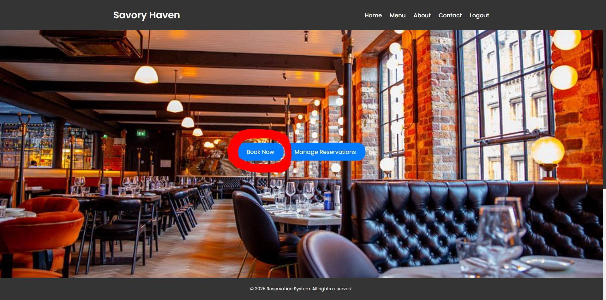
   
   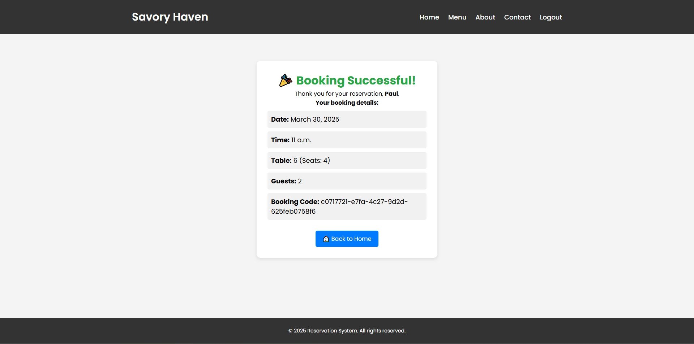

### 2. **Cancel/Edit Reservation**
   - Users can view their existing reservations and make changes or cancel them before the event date.
   - A confirmation email will be sent to the user once a reservation is canceled or edited.

   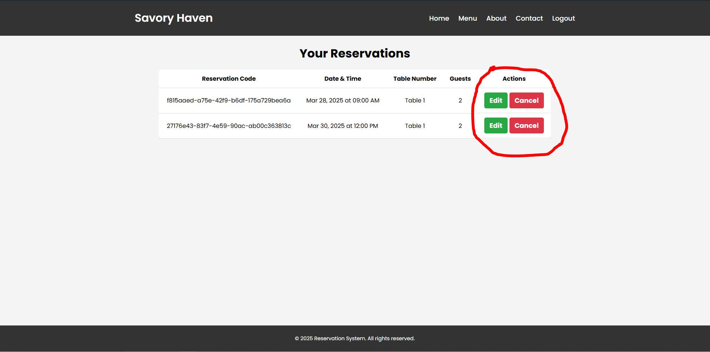
   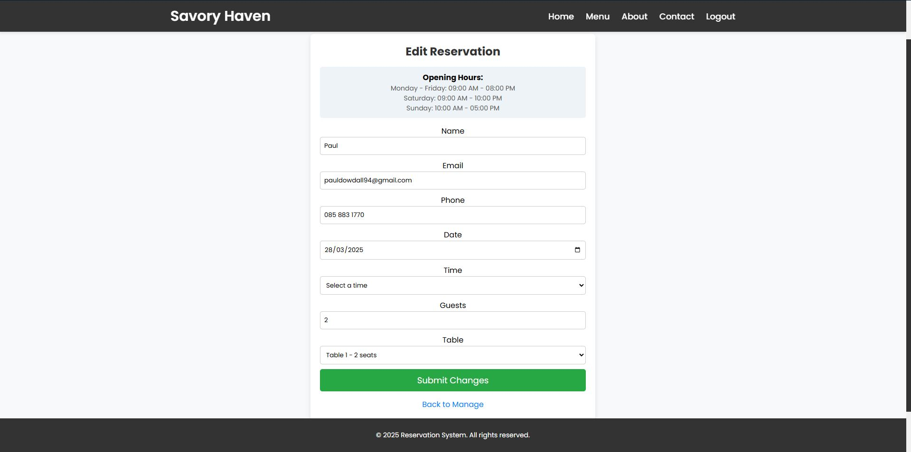
   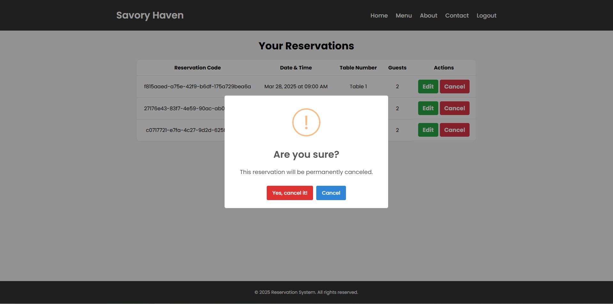
   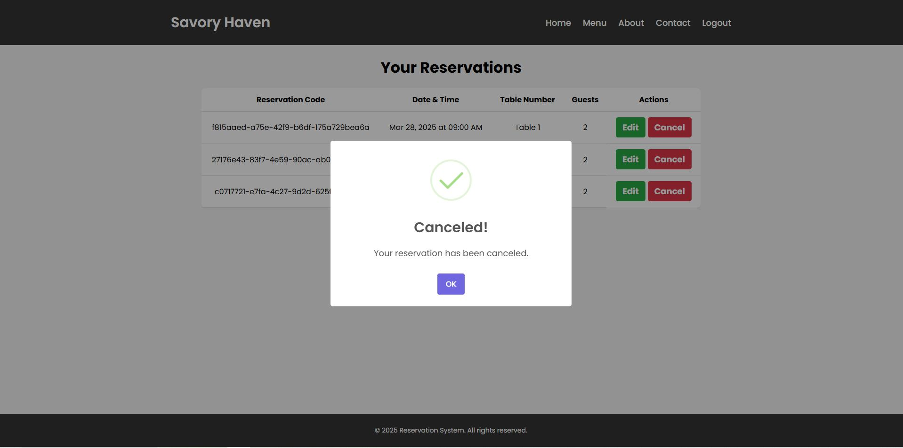

### 3. **Login**
   - Users can securely log in to their accounts to access their reservation history and profile.
   - Password recovery is available if users forget their login credentials.

   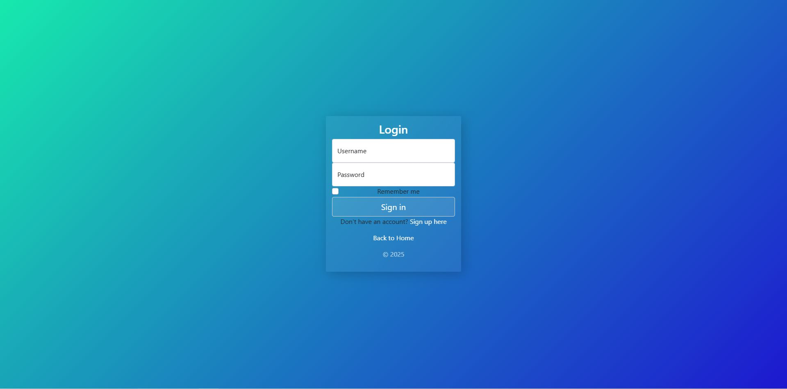

### 4. **Signup**
   - New users can easily create an account to begin making reservations and access other system features.
   - A confirmation email is sent after successful registration.

   

### 5. **Google Maps Integration**
   - The system integrates Google Maps to show the location of the restaurant or venue.
   - Users can see the venue's address and plan their route accordingly.

   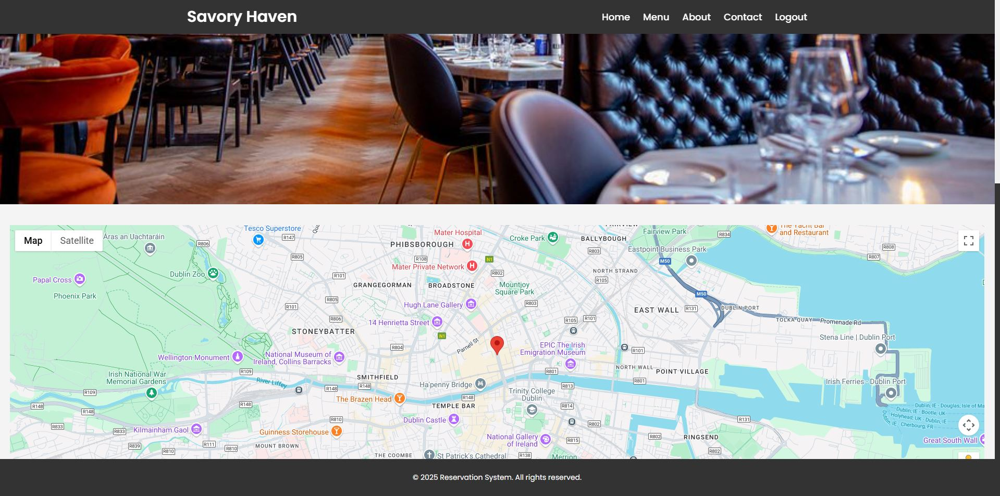

### 6. **Admin Dashboard**
   - **View All Reservations**: Admins can access a dashboard where they can view all reservations made by users.
   - **Manage Users**: Admins can view, modify, or delete user accounts.
   - **Manage Reservations**: Admins can modify or cancel reservations as needed.

   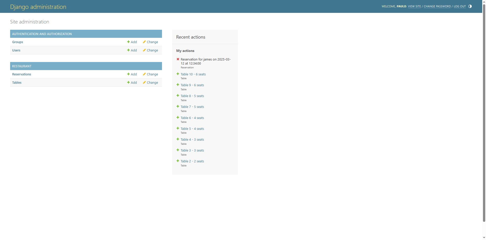

### 7. **Responsive Design**
   The system is fully responsive, ensuring a smooth user experience on both desktop and mobile devices.

   

### 8. **Menu**

    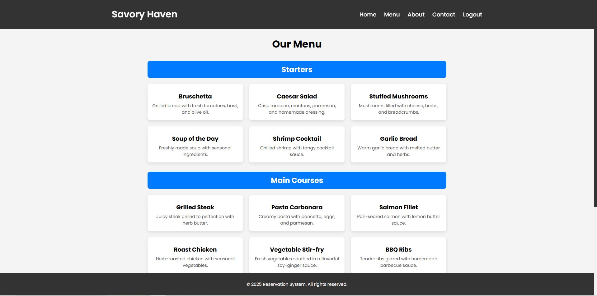

### 9. **About**

    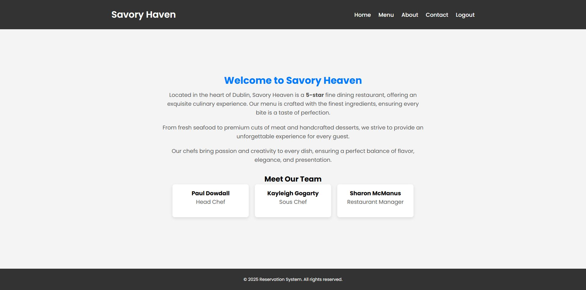

### 10. **Contact**

    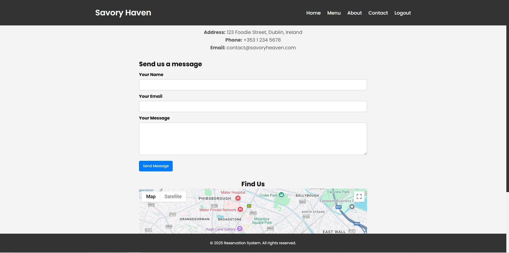

---

## Technologies Used

- **Backend**: Django (Python)
- **Frontend**: HTML, CSS, Bootstrap 5
- **Database**: SQLite (for local development), PostgreSQL (for production)
- **Authentication**: Django Allauth
- **Hosting**: Heroku for deployment

---

## Testing

### Manual Testing
Test all user stories, including:
- **User registration, login, and password recovery**: Ensure users can successfully register, log in, and recover their passwords.
- **Making, viewing, and canceling reservations**: Test the process of creating, viewing, and canceling reservations.
- **Admin managing users and reservations**: Verify that the admin can view and manage all users and reservations effectively.

### Automated Testing
Tests are written for key parts of the application such as:
- **User authentication**: Test the functionality of user sign-up, login, and password recovery.
- **Reservation creation and management**: Test the process of creating, viewing, and canceling reservations.
- **Email notifications**: Ensure that email notifications are sent for booking confirmations, cancellations, and other necessary updates.

---

## Acknowledgements
- Responsive Navbar made by - https://www.codingnepalweb.com/responsive-sticky-navigation-bar-html-css/
- Login and Logout forms made by - https://codepen.io/lekoalabe

